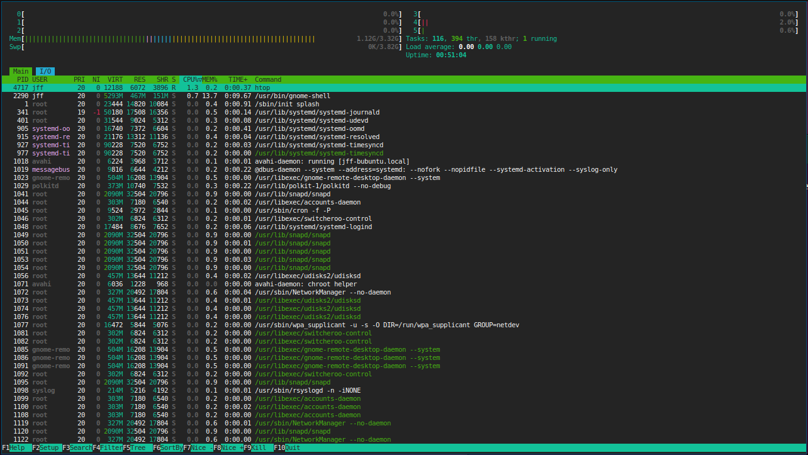
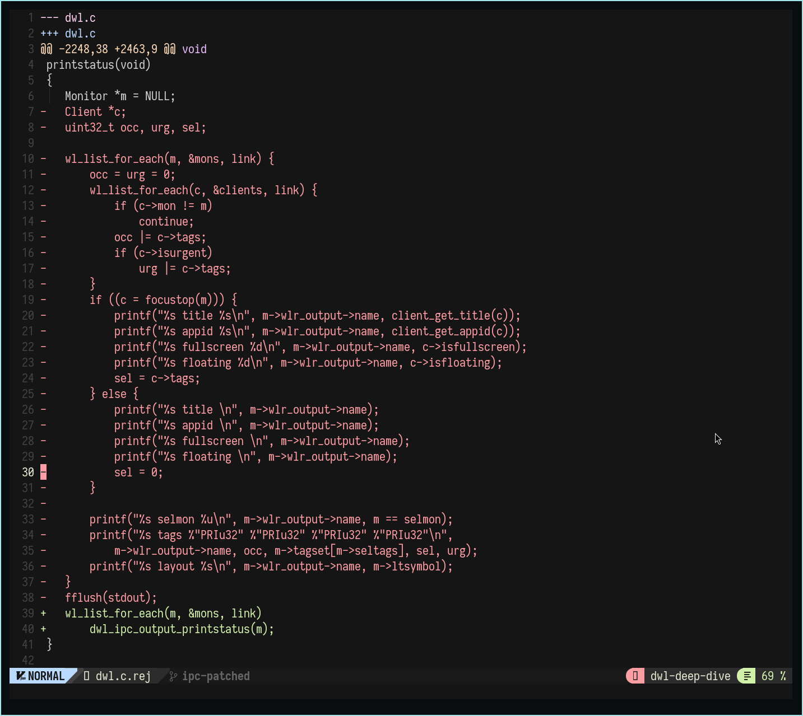
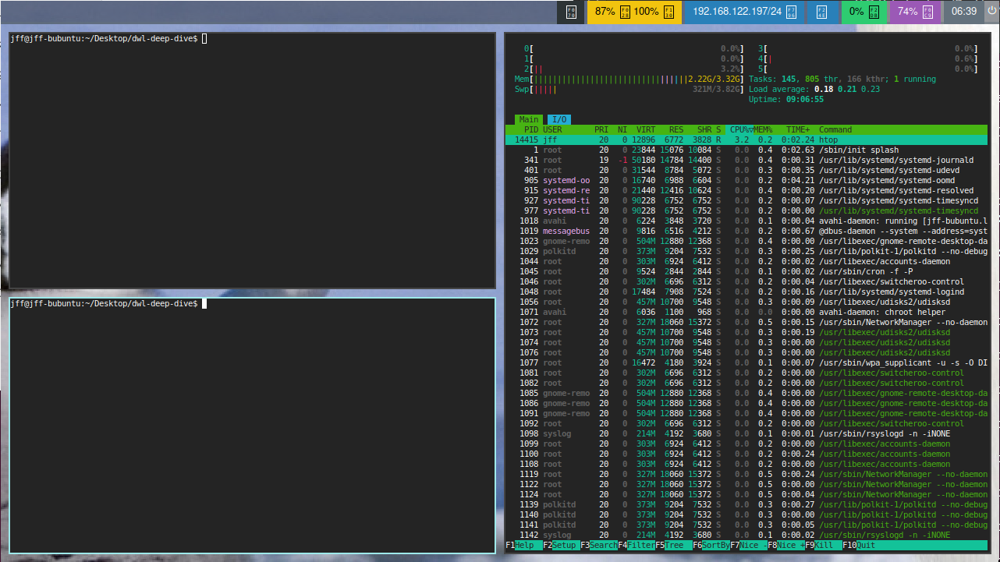
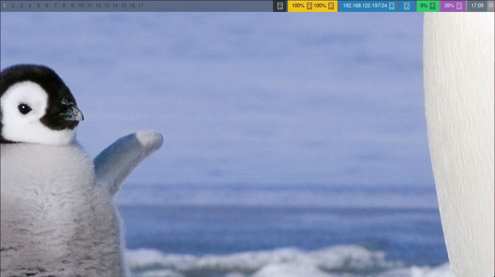
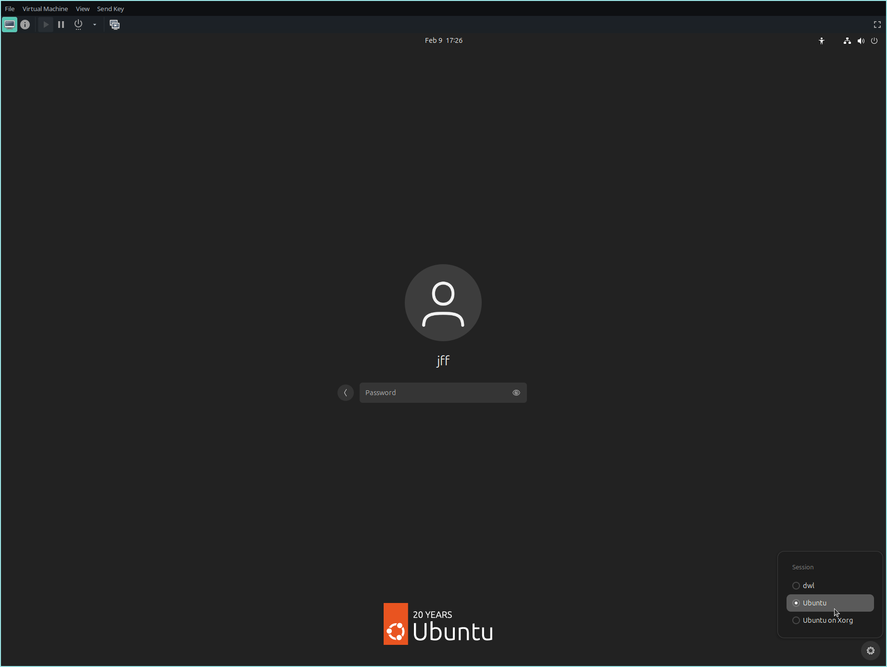
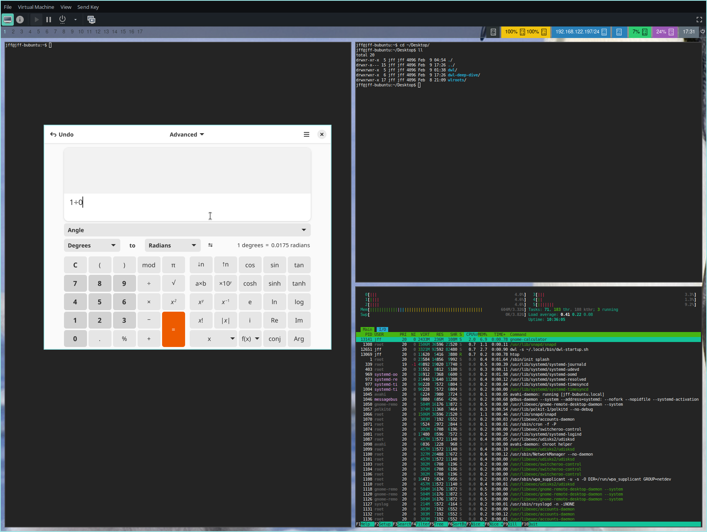

# Deep Dive into dwl

Welcome to the **Deep Dive into dwl** guide!  

This repository is a step-by-step guide for:
- **Installing** dwl, a minimal Wayland compositor inspired by dwm.
- **Patching** and tweaking dwl to suit your needs.
- **Configuring** keybindings, colors, and behavior via code.
- **Using** dwl as your daily window manager.

Whether you’re a beginner wanting to learn about minimal window managers or an experienced user looking to customize every detail, this guide will walk you through everything.

**Table of Contents:**
- [Introduction](#introduction)
- [Prerequisites](#prerequisites)
- [Installation](#installation)
- [Patching](#patching)
- [Configuration](#configuration)
- [Usage](#usage)
- [Troubleshooting](#troubleshooting)


# Introduction

**What Is a Window Manager?**

- **An operating system component that controls window clients on the screen.**

  - **Stacking Window Managers**  
    This is the most common type. Operating systems like Windows, macOS, and most mainstream Linux desktop environments use stacking window managers. In these, users control floating windows with a mouse.

  - **Tiling Window Managers**  
    These provide a more keyboard-driven experience, where the user launches and manages windows using predefined keybindings.  
    Under this category, there are: 
    - **Dynamic Tiling Window Managers**  
      In dynamic tiling window managers, window clients follow a predefined layout pattern that automatically splits the screen space.
    
    - **Manual Tiling Window Managers**  
      With manual tiling window managers, the user must decide which area the next window client will occupy.

---

**Common Misconceptions About Window Managers**

- **"They are so hard to set up."**  
  It depends. Yes, it might take more time than installing a full desktop environment, but once set up, it is built by you—for you. With dwl, you are the maintainer with full control; you choose which features to include and decide when (or if) changes need to be made. Nothing will interrupt your workflow.

- **"I want to pile my windows and manage them by mouse!"**  
  A little-known secret among window manager users is that most window managers offer a "floating" layout, where you can control window placement just as you would in a traditional desktop environment.

- **"I want to play games on my system."**  
  Many programs can request a preferred window state—usually floating—so you can run applications that rely on floating windows without any issues.

---

**What Does "I'm Using a Window Manager" Mean?**

When someone says, "I'm using a window manager," they typically mean that they are not running a full desktop environment (like GNOME, KDE, or XFCE) but rather a minimal system that provides only the basic window management functions. This approach implies that:

- **Manual Selection of Components:**  
  You choose and install the various components of your desktop environment yourself. This might include:
  - A **panel or status bar** for system information.
  - An **application launcher** (e.g., dmenu or rofi).
  - A **compositor** (if your window manager doesn’t include one).
  - **Notification daemons**, **background setters**, and other utilities.

- **DIY Configuration:**  
  Instead of relying on a prepackaged system, you manually configure these components. This often involves:
  - Editing configuration files.
  - Setting up autostart scripts for your applications.
  - Integrating third-party tools to build the complete experience you desire.

- **Full Control & Customization:**  
  Using just a window manager gives you complete control over your environment. You decide what features to include and how they work together, resulting in a highly customized and potentially lightweight system.

In short, "I'm using a window manager" reflects a do-it-yourself philosophy where you build your desktop environment piece by piece, rather than using a ready-made solution.

---

**Common Window Managers and Supporting Software**

Below is a list of some popular window managers along with their official websites, as well as common supporting programs that many users incorporate into their custom setups.

- **Window Managers:**
  - **Hyprland** – [https://hyprland.org/](https://hyprland.org/)
  - **Qtile** – [https://qtile.org/](https://qtile.org/)
  - **i3** – [https://i3wm.org/](https://i3wm.org/)
  - **Sway** – [https://swaywm.org/](https://swaywm.org/)
  - **bspwm** – [https://github.com/baskerville/bspwm](https://github.com/baskerville/bspwm)
  - **awesome** – [https://awesomewm.org/](https://awesomewm.org/)
  - **dwm** – [https://dwm.suckless.org/](https://dwm.suckless.org/)
  - **dwl** – [https://codeberg.org/dwl/dwl](https://codeberg.org/dwl/dwl)
  - **xmonad** – [https://xmonad.org/](https://xmonad.org/)
  - **Openbox** – [http://openbox.org/](http://openbox.org/)

- **Supporting Programs and Tools:**
  - **Application Launchers:**
    - **dmenu** – [https://tools.suckless.org/dmenu/](https://tools.suckless.org/dmenu/)
    - **wmenu** – [https://codeberg.org/adnano/wmenu/](https://codeberg.org/adnano/wmenu/)
    - **wofi** – [https://github.com/SimplyCEO/wofi/](https://github.com/SimplyCEO/wofi/)
    - **rofi** – [https://rofi.launcher.org/](https://rofi.launcher.org/)
  - **Panels and Bars:**
    - **Waybar** – [https://github.com/alexays/waybar/](https://github.com/alexays/waybar/)
    - **Polybar** – [https://polybar.github.io/](https://polybar.github.io/)
    - **Tint2** – [http://gitlab.com/o9000/tint2/](http://gitlab.com/o9000/tint2/)
  - **Compositors (for X11):**
    - **picom** – [https://github.com/yshui/picom](https://github.com/yshui/picom)
  - **Notification Daemons:**
    - **dunst** – [https://dunst-project.org/](https://dunst-project.org/)
  - **File Managers:**
    - **ranger** – [https://github.com/ranger/ranger](https://github.com/ranger/ranger)
    - **Thunar** – [https://docs.xfce.org/xfce/thunar/start](https://docs.xfce.org/xfce/thunar/start)
  - **Terminal Emulators:**
    - **st** (from suckless) – [https://st.suckless.org/](https://st.suckless.org/)
    - **foot** – [https://codeberg.org/dnkl/foot/](https://codeberg.org/dnkl/foot/)
    - **Alacritty** – [https://github.com/alacritty/alacritty](https://github.com/alacritty/alacritty)

- **Wayland-Specific Resources:**  
    Since this guide focuses on dwl—a Wayland compositor—here are some useful collections of software that support a pure Wayland experience:
    - [https://arewewaylandyet.com/](https://arewewaylandyet.com/) 
    - [https://github.com/swaywm/sway/wiki/Useful-add-ons-for-sway](https://github.com/swaywm/sway/wiki/Useful-add-ons-for-sway)
    - [https://wiki.gentoo.org/wiki/Wayland_Desktop_Landscape](https://wiki.gentoo.org/wiki/Wayland_Desktop_Landscape)

---

## What is dwl?

dwl is a minimal, dynamic window manager (really, a Wayland compositor) inspired by the [suckless philosophy](https://suckless.org/philosophy/) behind dwm. It emphasizes simplicity, small code size, and performance over feature bloat. In this guide, you’ll learn not only what dwl is but also how to set it up, customize it, and tailor it to your workflow.

## Why Choose dwl?

- **Simplicity:** No extraneous features—just what you need.
- **Customization:** Modify the source code directly to tweak behavior and appearance.
- **Efficiency:** Lightweight and optimized for speed.
- **Stability:** Once compiled, your binary remains unchanged by updates. Minimal runtime dependencies mean fewer moving parts that could be affected by system updates.
- **Wayland:** As a modern replacement for the X11 protocol, Wayland is designed to be easier to develop, extend, and maintain.

---

# Prerequisites

Before installing and using dwl, ensure you have the following:

- **Operating System:** A Linux distribution with Wayland support.
- **Development Tools:** `git`, `make`, `gcc` (or another C compiler).
- **Libraries and Dependencies:**  
  - Wayland libraries (e.g., `libwayland-dev`)
  - wlroots
  - Additional dependencies might include `libxkbcommon-dev`, etc.

A complete list of the needed dependencies can be found in the [dwl repository](https://codeberg.org/dwl/dwl/src/tag/v0.7).  
`Package names may differ depending on your distribution.`

For this guide, we’ll take the more challenging route and install dwl on Ubuntu 24.10 (Oracular Oriole).  
`Note: Ubuntu 24.10’s repositories contain outdated package versions. A more user-friendly approach is to use a distribution with more up-to-date packages, such as Fedora, OpenSUSE, Arch Linux, or Gentoo.`

---

## Building dwl on Ubuntu 24.10 (Oracular Oriole)

#### The Issue
   To build dwl v0.7, you need wlroots version 0.18. However, Ubuntu 24.10 only provides wlroots v0.17.4 in its repositories. This mismatch means you must compile both wlroots and dwl from source.

#### Steps to Build `dwl` on Ubuntu 24.10

1. **Install Dependencies:**  
   Update your package repositories and upgrade:
   ```bash
   sudo apt update && sudo apt upgrade -y
   ```

   Then install the required dependencies for building wlroots and dwl:
   ```bash
   sudo apt install -y git cmake meson ninja-build \
   libwayland-dev libxkbcommon-dev \
   libseat-dev libinput-dev \
   libdrm-dev libgbm-dev \
   libpixman-1-dev liblcms2-dev \
   libxcb-render0-dev libxcb-shape0-dev \
   libxcb-xfixes0-dev libxcb-sync-dev \
   libxcb-damage0-dev libxcb-glx0-dev \
   libxcb-composite0-dev libepoxy-dev \
   libxcb-present-dev libxcb-icccm4-dev \
   libxcb-xinput-dev \
   libxcb-res0-dev libxcb-render-util0-dev \
   libxcb-dri3-dev libdisplay-info-dev \
   libliftoff-dev libxcb-ewmh-dev libxcb-shm0-dev\
   libcap-dev  libsystemd-dev  libvulkan-dev  \
   libwlroots12t64  libx11-xcb-dev  libxcb-image0-dev \
   libegl1-mesa-dev libgles2-mesa-dev wayland-protocols \
   libwlroots-dev
   ```

2. **Clone and Build wlroots:**
   Clone the wlroots repository and check out version 0.18.0:
   ```bash
   git clone https://gitlab.freedesktop.org/wlroots/wlroots.git
   cd wlroots
   git checkout 0.18.0  # Checkout the required version
   ```
   **Configure the build:** 
   ```bash
   meson setup \
      -Dxwayland=enabled \
      -Drenderers=gles2 \
      -Dbackends=auto \
      build
   ```
   After configuration, you should see output similar to:
   ```bash
	wlroots 0.18.2

    drm-backend     : YES
    x11-backend     : YES
    libinput-backend: YES
    xwayland        : YES
    gles2-renderer  : YES
    vulkan-renderer : NO
    gbm-allocator   : YES
    session         : YES
    color-management: YES
    xcb-errors      : NO
    egl             : YES
    libliftoff      : YES

  	User defined options
    backends        : auto
    renderers       : gles2
    xwayland        : enabled
   ```

   **Build and install wlroots:**
   ```bash
   ninja -C build
   sudo ninja -C build install
   ```

   **Verify the installation:**
   ```bash
   pkg-config --libs wlroots-0.18
   ```
   You should see output similar to:
   ```bash
   -L/usr/local/lib/x86_64-linux-gnu -lwlroots-0.18
   ```
   Finally, update the linker cache:
   ```bash
   sudo ldconfig
   ```
   Now we should have fully functional wlroots library for our dwl.

---

# Installation

Follow these steps to install dwl from source.

1. **Clone the Repository:**

   Clone the dwl repository and check out the v0.7 tag:
   ```bash
   git clone https://codeberg.org/dwl/dwl.git
   cd dwl
   git checkout v0.7  # Checkout the desired version
   ```

2. **Configure config.mk:**

   To enable XWayland build options, edit `config.mk` and uncomment the following lines:
   ```bash
   #XWAYLAND = -DXWAYLAND
   #XLIBS = xcb xcb-icccm
   ```

3. **(Optional) Copy the Default Configuration:**

   Many suckless projects include a default configuration file. If `config.def.h` exists, you can copy it:
   ```bash
   cp config.def.h config.h
   ```
   `(Note: config.def.h holds the default configuration values for dwl. On the first run of make, it may be automatically copied to config.h.)`

4. **Test can we build dwl:**  
   Compile dwl:
   ```bash
   make
   ```
   If there are no compile-time errors, dwl is ready for an initial test.

5. **Test dwl:**  
    Run dwl to see if it starts correctly:
   ```bash
   ./dwl
   ```
   You should see a magnificent grey box—this indicates that dwl is up and running! 
   

6. **Install a Wayland Terminal Emulator and Application Launcher:**  

   dwl defaults to using the foot terminal—a modern and minimal Wayland terminal emulator. You can change the default later in config.h. For now, install foot and wmenu (for launching applications):
   ```bash
    sudo apt install -y foot wmenu
   ```
   Run dwl again:
   ```bash
   ./dwl
   ```
   Now press the default key combination `(ALT + SHIFT + ENTER)` to spawn a terminal window: 
   

   Now we have a very feature rich dwl environment up and running! You can test it out by using some of the default keybindings:
   - `ALT + SHIFT + ENTER` spawn terminal
   - `ALT + p` spawn wmenu dwl's default application launcher
   - `ALT + SHIFT + C` closes active client
   - `ALT + SHIFT + Q` quits dwl

   This is very cool and all, but still not very usable. Lets move on to the patching phase to add more features.

---


# Patching

One of the joys of suckless software is the ability to patch the source to add new features. Here’s how you can work with patches in dwl:

1. **Finding or Creating Patches:**

   Look for community patches online or write your own modifications.  
   The main source for dwl patches is the official repository:
   [dwl-patches](https://codeberg.org/dwl/dwl-patches)

2. **Applying a Patch:**

  If you have a patch file (e.g., myfeature.patch), you can apply it in several ways:

  ```bash
   git am -3 path/to/myfeature.path

   git apply path/to/myfeature.patch
   
   patch -p1 < path/to/myfeature.patch 
  ```
  Make sure you run the command in the root of the dwl source directory. (Using Git commands assumes the source is under version control.)

3. **Review the Patch:**

  Always review the changes in the patch file to understand what modifications it makes.

4. **Rebuild:**

  After applying a patch, rebuild dwl to incorporate the changes:

   ```bash
   make clean all
   ```


## Patching our dwl

1. **Patches Used in This Guide:**  

   - [btrtile](https://codeberg.org/dwl/dwl-patches/src/branch/main/patches/btrtile)  
     A tiling layout that gives the user more control over tiled clients, with full support for managing clients via both keyboard and mouse.

   - [focusdir](https://codeberg.org/dwl/dwl-patches/src/branch/main/patches/focusdir)  
     Enables moving focus between clients.

   - [rotatetags](https://codeberg.org/dwl/dwl-patches/src/branch/main/patches/rotatetags)  
     Allows you to rotate the view or shift clients between tags.

   - [warpcursor](https://codeberg.org/dwl/dwl-patches/src/branch/main/patches/warpcursor)  
     Moves the cursor to the focused client.

   - [pertag](https://codeberg.org/dwl/dwl-patches/src/branch/main/patches/pertag)  
     Allows each tag to have individual tiling layout setups.

   - [gaps](https://codeberg.org/dwl/dwl-patches/src/branch/main/patches/gaps)  
     Adds gaps between clients and screen edges for a cleaner look.

   - [ipc](https://codeberg.org/dwl/dwl-patches/src/branch/main/patches/ipc)  
     IPC-protocol for dwl, we need it later for our waybar (taskbar).

--- 


2. **Version Control Best Practices:**

	It’s best to use Git to track changes while applying patches. You can:
	- Create separate branches for each patch. This makes applying patches to an unmodified dwl source smoother, though merging later may be more involved. 
    - Commit after applying each patch. This provides version control and the ability to revert changes if necessary.

3. **Create repository for our dwl**  
	(Optional) You can use a local Git repository or create a fork of the dwl repository.   
    For this guide, we’ll clone the upstream repository:
    ```bash
    git clone yourrepo
    git remote add --fetch upstream https://codeberg.org/dwl/dwl
    git fetch upstream --tags
    git checkout -b my-dwl tags/v0.7
    ```
    Now we should have our own dwl branch.

--- 

4. - **Download the Needed Patches:**

    Paste the following commands into your terminal to download all patch files:
    ```bash
    wget https://codeberg.org/dwl/dwl-patches/raw/branch/main/patches/rotatetags/rotatetags.patch
    wget https://codeberg.org/dwl/dwl-patches/raw/branch/main/patches/warpcursor/warpcursor.patch
    wget https://codeberg.org/dwl/dwl-patches/raw/branch/main/patches/pertag/pertag.patch
    wget https://codeberg.org/dwl/dwl-patches/raw/branch/main/patches/gaps/gaps.patch
    wget https://codeberg.org/dwl/dwl-patches/raw/branch/main/patches/focusdir/focusdir.patch
    wget https://codeberg.org/dwl/dwl-patches/raw/branch/main/patches/btrtile/btrtile-v0.7-gaps.patch
    wget https://codeberg.org/dwl/dwl-patches/raw/branch/main/patches/ipc/ipc.patch
    wget https://codeberg.org/dwl/dwl-patches/raw/branch/main/patches/ipc/ipcpertag.patch
    ```

   Create a directory for the patches and move the files:  
   ```bash
   mkdir patches
   mv *.patch patches/
   ```
   Save the base state of your repository:
   ```bash
   git add .
   git commit -m "my-dwl patches"
   git push
   ```
   Might need extra steps to setup the upstream for the branch. (push --set-upstream origin my-dwl)

5. - **Apply the Patches**  
	Create a branch for each patch and apply them:
    ```bash
    git branch btrtile-patched
    git checkout btrtile-patched
    git am -3 patches/btrtile-v0.7-gaps.patch 
    git checkout my-dwl

    git branch gaps-patched
    git checkout gaps-patched
    git am -3 patches/gaps.patch
    git checkout my-dwl

    git branch pertag-patched
    git checkout pertag-patched
    git am -3 patches/pertag.patch
    git checkout my-dwl

    git branch focusdir-patched
    git checkout focusdir-patched
    git am -3 patches/focusdir.patch
    git checkout my-dwl

    git branch rotatetags-patched
    git checkout rotatetags-patched
    git am -3 patches/rotatetags.patch
    git checkout my-dwl

    git branch warpcursor-patched
    git checkout warpcursor-patched
    git am -3 patches/warpcursor.patch
    git checkout my-dwl

    git branch ipc-patched
    git checkout ipc-patched
    git am -3 patches/ipc.patch
    ```
    **Handling the ipc Patch Issue:**  
    When applying the ipc patch, you might encounter errors like:
    ```bash
    Applying: implement dwl-ipc-unstable-v2 https://codeberg.org/dwl/dwl-patches/wiki/ipc
    Using index info to reconstruct a base tree...
    M	Makefile
    M	dwl.c
    Falling back to patching base and 3-way merge...
    Auto-merging dwl.c
    CONFLICT (content): Merge conflict in dwl.c
    Auto-merging Makefile
    error: Failed to merge in the changes.
    Patch failed at 0001 implement dwl-ipc-unstable-v2 https://codeberg.org/dwl/dwl-patches/wiki/ipc
    ```
    Since this patch lacks the necessary Git metadata, try using a different method:
    ```bash
    git am --abort
    git apply patches/ipc.patch
    error: patch failed: Makefile:17
    error: Makefile: patch does not apply
    error: patch failed: dwl.c:2033
    error: dwl.c: patch does not apply
    ```
    If that fails, resort to the patch command:
    ```bash
    patch -p1 < patches/ipcpertag.patch
    patching file Makefile
    Hunk #1 succeeded at 17 with fuzz 1.
    patching file config.def.h
    patching file dwl.c
    Hunk #1 succeeded at 67 (offset -1 lines).
    Hunk #2 succeeded at 144 (offset -1 lines).
    Hunk #3 succeeded at 195 (offset -1 lines).
    Hunk #4 succeeded at 293 (offset -1 lines).
    Hunk #6 succeeded at 433 (offset 2 lines).
    Hunk #7 succeeded at 729 (offset 3 lines).
    Hunk #8 succeeded at 1013 (offset 3 lines).
    Hunk #9 succeeded at 1365 (offset 2 lines).
    Hunk #10 FAILED at 2248.
    Hunk #11 succeeded at 2840 (offset 41 lines).
    Hunk #12 succeeded at 2939 (offset 41 lines).
    1 out of 12 hunks FAILED -- saving rejects to file dwl.c.rej
    patching file protocols/dwl-ipc-unstable-v2.xml
    ```

    Now lets see what's causing issues by opening dwl.c.rej with your favorite text editor:
    ```bash
    vim dwl.c.rej
    ```
    
    

    Rejection file shows that the first problem occured after line 2248 at `printstatus` function, when applying patch hunk 10.
    Patch diff shows code that it tries to remove with red color and green indicadetes the code it tries to add.
    
    Lets open the source code for dwl.
    
    ```bash
    vim dwl.c
    #lets find the rejected section /printstatus
    ```
    Locate the `printstatus` function and manually adjust it according to the patch’s diff. The corrected function should look like:
    ```code
    void
    printstatus(void)
    {
    	Monitor *m = NULL;
    
    	wl_list_for_each(m, &mons, link)
    		dwl_ipc_output_printstatus(m);
    }
    ```
    Remove any .rej and .orig files:
    ```bash
    rm *.rej && rm *.orig
    ```
	Then build dwl to verify that the patch was successfully applied:
    ```bash
    make
    ./dwl
    ```
    Once confirmed, clean up and commit your changes:
    ```bash
    make clean && rm config.h
    git add .
    git commit -m "ipc-patched"
    ```
    Finally, apply the ipcpertag patch:
    ```bash
    git am -3 patches/ipcpertag.patch
    git checkout my-dwl
    ```

6. - **Now lets merge the patches to our main branch**

   From your main branch (my-dwl), merge each patch branch:
   ```bash
   git merge --no-ff btrtile-patched
   git merge --no-ff gaps-patched
   git merge --no-ff pertag-patched
   Auto-merging dwl.c
   CONFLICT (content): Merge conflict in dwl.c
   Automatic merge failed; fix conflicts and then commit the result.
   ```
   We have a conflict.  
   If you encounter merge conflicts (e.g., in dwl.c), open the file and search for conflict markers (<<<<<<< HEAD). Remove the markers and resolve the differences. For example:
   ```bash
   vim dwl.c 

   <<<<<<< HEAD
   typedef struct TreeLayout TreeLayout;
   =======
   typedef struct Pertag Pertag;
   >>>>>>> pertag-patched
   ```
   Should be resolved to: 
   ```bash
   typedef struct TreeLayout TreeLayout;
   typedef struct Pertag Pertag;
   ```
   `To search the issues in vim: /<<<<<<< HEAD press n to search next N to search previous.`

   Then continue the merge:
   ```bash
   git add .
   git merge --continue
   ```
   Lets continue merging our patches:
   ```bash
   git merge --no-ff focusdir-patched
   git merge --no-ff rotatetags-patched

   Auto-merging config.def.h
   CONFLICT (content): Merge conflict in config.def.h
   Auto-merging dwl.c
   Automatic merge failed; fix conflicts and then commit the result.
   ```
   Repeat the earlier process by removing the conflict markers from config.def.h:
   ```bash
   <<<<<<< HEAD
   enum Direction { DIR_LEFT, DIR_RIGHT, DIR_UP, DIR_DOWN };
   =======
   enum {
       VIEW_L = -1,
       VIEW_R = 1,
       SHIFT_L = -2,
       SHIFT_R = 2,
   } RotateTags;
   
   >>>>>>> rotatetags-patched
   ```
   Should be resolved to:
   ```bash
   enum Direction { DIR_LEFT, DIR_RIGHT, DIR_UP, DIR_DOWN };
   enum {
       VIEW_L = -1,
       VIEW_R = 1,
       SHIFT_L = -2,
       SHIFT_R = 2,
   } RotateTags;
   ```
   Then continue the merge:
   ```bash
   git add .
   git merge --continue
   git merge --no-ff warpcursor-patched
   git merge --no-ff ipc-patched
   ```
   Now we have merged all our patch branches with our dwl branch.  

   Verify the merged branch by compiling and running dwl:
   ```bash
   make
   ./dwl
   ```
   Seems to work, hurray! patching process officielly debunked.  
   Lets clean up and save the state:
   ```bash
   make clean && rm config.h
   ```
   (Optional) You can push changes if you made remote repository:
   ```bash
   git push
   ```

---

# Configuration

dwl is configured by modifying its configuration header directly. Here’s how to get started:

## General Configuration Procedure

1. - **Locate the Configuration File:**

   dwl’s configuration settings are stored in config.h, which is generated from config.def.h. If config.h does not exist, compile dwl to generate it. 
   Then open it in your favorite editor:

   ```bash
   vim config.h
   ```

2. - **Key Settings in config.h:**

       - Colors:   
       Adjust window border colors.
       - TAGCOUNT:  
       Defines tag count, similar to workspaces or virtual desktops.
       - rules:  
       Add window rules for specific clients, you need to know the application title. (You can choose to open some programs always on floating state etc.)
       - layouts:  
       Avaivable tiling layouts, defines how the clients are tiled/organised on the desktop. Defaults to the first option on the list.
       - monrules:  
       Monitor configure your monitor settings to your liking. If using single monitor setup, the default NULL option usually works great.
       - xkb_rules:  
       Keyboard settings.
       - MODKEY:  
       Define the modifier key, defaults to ALT but common practice is to change it to `super`/`windows`/`command`-key aka WLR_MODIFIER_LOGO.
       - TAGKEYS:  
       Keybindings to switch the view between tags and send clients to other tags.
       -SHCMD:  
       Shell spawn programs with, you can call these with your keybindings.
       - Keys:   
       Section where keybindings are defined and change them as needed.
       - buttons:  
       Mouse related bindings.
  
  For reference, you can check [my config.h](https://github.com/julmajustus/dwl-deep-dive/blob/my-dwl/config.h). (Some configuration options in my file might conflict with your setup, such as monitor configurations or locally installed programs.)

3. - **Rebuild dwl:**

  After making changes, rebuild the compositor:

   ```bash
   make clean all
   ```

4. - **Testing Your Changes:**  

Restart your session or run dwl in a nested environment to see your changes in action.

## Setup and install essential programs to use with our dwl

Even after configuring dwl, a few additional programs are needed to create a fully usable environment.   
For this guide we will install:
  - A status bar: [waybar](https://github.com/Alexays/Waybar).
  - Program to set desktop wallpaper: [swaybg](https://github.com/swaywm/swaybg).
  - Notification daemon: [mako](https://github.com/emersion/mako).
  - Create a start up script to call our programs on startup.
  
  Install the programs:
  ```bash
  sudo apt install -y waybar swaybg mako-notifier
  ```
  Create your startup script (e.g., ~/.local/bin/dwl-startup.sh):
  ```bash
  #!/bin/bash

  # Kill already running dublicate process
  _ps=(waybar mako swaybg)
  for _prs in "${_ps[@]}"; do
  	if [[ `pidof ${_prs}` ]]; then
  		killall -9 ${_prs}
  	fi
  done

  # Start our applications
  swaybg --output '*' --mode center  --image /path-to-your-favorite-wallpaper &
  mako &
  waybar &
  foot --server &
  ```
  Make the script executable:
  ```bash
  chmod +x ~/.local/bin/dwl-startup.sh
  ```
  Test the startup script with dwl:
  ```bash
  make
  ./dwl -s ~/.local/bin/dwl-startup.sh
  ```
  
  Now we should have a running dwl setup with status bar, desktop wallpaper and notification manager.
  For the scope of this guide, we're not going to dive into configuring the support programs, but let's enable dwl related options from out Waybar statusbar.
  
  To integrate Waybar with dwl, copy the default Waybar configuration to your local config directory:
  ```bash
  cp -r /etc/xdg/waybar/ ~/.config/
  ```
  Edit the config with your favorite editor:
  ```bash
  vim ~/.config/waybar/config.jsonc
  ```
  Locate the section:
  ```bash
  "modules-left": [
        "sway/workspaces",
        "sway/mode",
        "sway/scratchpad",
        "custom/media"
    ],
   ```
   Replace it with dwl-specific modules:
   ```bash
  "modules-left": [
        "dwl/tags",
        "custom/media"
    ],
  ```
  Add a tag module for dwl under "Modules configuration":
  ```bash
   "dwl/tags": {
            "num-tags": 17,
            "tag-labels": [ "1", "2", "3", "4", "5", "6", "7", "8", "9", "10", "11", "12", "13", "14", "15", "16", "17" ],
            "disable-click": false
    },
  ```
  Note: The num-tags value must match your TAGCOUNT in config.h
  Next, edit the Waybar stylesheet:
  ```bash
  vim ~/.config/waybar/style.css
  ```
  Append the following styles:
  ```bash
  #tags button {
  	color: #343A40;
  	padding: 0 3px;
  	
  }
  
  #tags button.occupied {
  	color: #bbbbbb;
  	
  }
  
  #tags button.focused {
  	color: #9EE9EA;
  }
  
  #tags button.urgent {
  	color: #E49186;
  }
  ```
  
  Now we have waybar showing our current tags on status bar!  

  For further configuration of Waybar, refer to the [Waybar Wiki](https://github.com/Alexays/Waybar/wiki).

---

# Usage

## Install dwl system wide
  Once your setup is working with all necessary programs, install dwl system-wide.

  **Starting dwl:**

   Depending on your setup, you might start dwl via:
   - A display manager session (select dwl from the session options)
   - A command-line start in a TTY (ensure your environment is configured to run Wayland compositors; additional environment variables might be needed)

  For this guide, we’ll launch dwl from the display manager. Edit the dwl.desktop file in your dwl directory:
  ```bash
  vim dwl.desktop
  ```
  Update the Exec line to use your startup script:
  ```bash
  [Desktop Entry]
  Name=dwl
  Comment=dwm for Wayland
  Exec=dwl -s ~/.local/bin/dwl-startup.sh
  Type=Application
  ```
  Then install dwl system-wide:
  ```bash
  sudo make clean install
  ```
  Log out of your current desktop environment; dwl should now appear in the available session menu. 
  
  Select dwl and log in.
  

  Congratulations—you’ve successfully patched and installed a working dwl window manager!

---

## What next?

After installation and configuration, here are some suggestions:

1. **Use your system**

   - You’ll quickly discover which components you might be missing from your previous setup. Tweak and modify your configuration accordingly, and add more patches if needed.

2. **Get used to the keybindings and controls:**

   The default keybindings are defined in `config.h`. Some common actions include:
   - **Launching Applications:** A keybinding might open a terminal or dmenu-like launcher.
   - **Window Navigation:** Move focus between windows with your configured key combos.
   - **Tiling/Floating:** Switch windows between tiling and floating mode.

3. **Tips for Daily Use:**

   - **Restarting dwl:** After making changes and rebuilding, you may need to restart your session.
   - **Debugging:** Run dwl from a terminal to view log messages and error outputs.

4. **Additional Resources:**

   Visit [https://codeberg.org/dwl/dwl](https://codeberg.org/dwl/dwl) for the latest updates and documentation.  
   Find new patches [https://codeberg.org/dwl/dwl-patches](https://codeberg.org/dwl/dwl-patches).  
   Join us on our IRC channel: #dwl on Libera Chat  
   Or on the community-maintained [Discord server](https://discord.gg/jJxZnrGPWN)


# Troubleshooting

Here are some common issues you might encounter and tips on how to resolve them:

1. **Build Errors:**
   - Ensure all dependencies are installed.
   - Check that you are using the correct compiler and build tools.

2. **Configuration Not Applying:**
   - Verify that you edited the correct configuration file.
   - Re-run `make clean install` after any change.

3. **Display Issues:**
   - Make sure your system supports Wayland.
   - Check logs for error messages (running dwl from a terminal can help).

4. **Patch Conflicts:**
   - If a patch fails to apply cleanly, review the diff and resolve conflicts manually.
   - Consult the dwl community or documentation for guidance.

5. **Applications Not Launching:**
   - Verify that dwl was compiled with XWayland support (if needed). (Defined at config.mk).
   - Run the application from a terminal to check for errors.
   - Ensure a D-Bus session is active.

6. **dwl Starts from Terminal but Not from TTY or Display Manager:**
   - Additional configuration of environment variables may be required.   
   See [dwl Running Instructions](https://codeberg.org/dwl/dwl#running-dwl) for more details.
   
